# 당고킬러 ERD

> 원본은 구글 시트 `당고킬러_테이블명세서`입니다. 이 파일은 2026-10-04 기준 사본입니다.
> 스키마를 바꿀 때는 시트를 먼저 고치고 팀에 알린 뒤 이 파일과 [`erd.sql`](erd.sql)을 다시 뽑습니다.

14테이블 · 222컬럼 · FK 23개. DB 반영은 [`app/core/db/migrations`](../../app/core/db/migrations)를 따릅니다.

## 다이어그램

```mermaid
erDiagram
    users ||--o{ health_records : "기록"
    users ||--o{ predictions : "예측"
    health_records ||--o{ predictions : "입력"
    predictions ||--o{ prediction_contributions : "기여요인"
    users ||--o{ user_monsters : "보유"
    monsters ||--o{ user_monsters : "원형"
    predictions |o--o{ user_monsters : "최신예측"
    health_records |o--o{ user_monsters : "최신기록"
    users ||--o{ user_attack_cycles : "공략주기"
    user_monsters ||--o{ user_attack_cycles : "공략대상"
    users ||--o{ user_challenges : "수행"
    challenges ||--o{ user_challenges : "원형"
    challenge_recommendations |o--o{ user_challenges : "추천시작"
    predictions |o--o{ user_challenges : "근거예측"
    user_attack_cycles |o--o{ user_challenges : "주기소속"
    user_challenges ||--o{ user_challenge_occurrences : "예정기회"
    challenge_logs |o--o| user_challenge_occurrences : "인정기록"
    user_challenges ||--o{ challenge_logs : "수행기록"
    users ||--o{ challenge_recommendations : "추천"
    challenges ||--o{ challenge_recommendations : "대상"
    user_attack_cycles |o--o{ challenge_recommendations : "주기"
    users ||--o{ user_rewards : "획득"
    rewards ||--o{ user_rewards : "원형"

    users {
        bigint id PK
        varchar email UK
        varchar password_hash
        varchar nickname
        smallint birth_year
        enum sex
        decimal height_cm
        enum motivation_type
        boolean dm_diagnosed
        boolean htn_diagnosed
        boolean dm_medication
        boolean htn_medication
        int total_xp
        smallint level
        datetime disclaimer_agreed_at
        tinyint login_fail_count
        datetime locked_until
        enum status
        datetime withdrawn_at
        datetime created_at
        datetime updated_at
    }

    health_records {
        bigint id PK
        bigint user_id FK
        datetime recorded_at
        enum input_mode
        decimal weight_kg
        decimal waist_cm
        decimal bmi
        boolean smoking_current
        tinyint alcohol_frequency
        tinyint alcohol_amount
        tinyint walking_days
        smallint walking_minutes
        tinyint strength_days
        smallint sitting_minutes
        boolean family_history_dm
        boolean family_history_htn
        tinyint dining_out_freq
        smallint sbp
        smallint dbp
        smallint fasting_glucose
        decimal hba1c
        smallint triglyceride
        smallint hdl
        smallint total_cholesterol
        datetime created_at
        datetime updated_at
    }

    predictions {
        bigint id PK
        bigint user_id FK
        bigint health_record_id FK
        varchar job_id UK
        enum status
        decimal dm_probability
        enum dm_grade
        decimal htn_probability
        enum htn_grade
        tinyint metabolic_count
        varchar model_version
        json input_snapshot
        datetime predicted_at
        datetime created_at
        datetime updated_at
    }

    prediction_contributions {
        bigint id PK
        bigint prediction_id FK
        enum disease
        varchar factor_key
        decimal contribution
        enum direction
        tinyint rank
        datetime created_at
    }

    monsters {
        bigint id PK
        varchar code UK
        tinyint no UK
        varchar name
        varchar title
        json factor_keys
        enum disease_scope
        enum default_impact_source
        boolean is_enabled
        datetime created_at
        datetime updated_at
    }

    user_monsters {
        bigint id PK
        bigint user_id FK
        bigint monster_id FK
        tinyint impact_score
        enum state
        datetime sealed_at
        datetime resolved_at
        datetime reawakened_at
        smallint seal_count
        enum impact_source
        bigint last_prediction_id FK
        bigint last_health_record_id FK
        smallint weekly_progress
        date progress_week_start
        datetime created_at
        datetime updated_at
    }

    user_attack_cycles {
        bigint id PK
        bigint user_id FK
        bigint target_user_monster_id FK
        bigint active_user_id UK "생성 컬럼. status=active일 때만 user_id"
        date start_date
        date end_date
        enum status
        tinyint extra_added_count
        varchar policy_version
        datetime created_at
        datetime updated_at
    }

    challenges {
        bigint id PK
        varchar code UK
        varchar title
        varchar description
        enum category
        varchar factor_key
        enum goal_type
        decimal target_value
        varchar unit
        tinyint daily_target_count
        smallint duration_days
        enum verification_type
        enum difficulty
        enum relation_type
        varchar exclude_condition
        varchar context_label
        boolean manual_fallback_allowed
        enum context_type
        json context_slots
        smallint reward_xp
        smallint progress_value
        boolean is_enabled
        boolean safety_check_required
        tinyint context_priority
        json personalization_policy
        datetime created_at
        datetime updated_at
    }

    user_challenges {
        bigint id PK
        bigint user_id FK
        bigint challenge_id FK
        bigint recommendation_id FK
        bigint source_prediction_id FK
        bigint cycle_id FK
        enum status
        date start_date
        date end_date
        tinyint daily_target_count_snapshot
        decimal target_value_snapshot
        smallint duration_days_snapshot
        datetime completed_at
        datetime stopped_at
        varchar stop_reason
        boolean habit_established
        json goal_config_snapshot
        smallint completed_occurrence_count
        smallint planned_occurrence_count
        decimal completion_rate
        datetime summary_computed_at
        varchar summary_policy_version
        datetime created_at
        datetime updated_at
    }

    user_challenge_occurrences {
        bigint id PK
        bigint user_challenge_id FK
        bigint completed_log_id FK
        date scheduled_date
        varchar slot_code
        tinyint sequence_no
        enum status
        datetime completed_at
        datetime created_at
        datetime updated_at
    }

    challenge_logs {
        bigint id PK
        bigint user_challenge_id FK
        date log_date
        datetime occurred_at
        tinyint sequence_no
        enum context_slot
        decimal value
        varchar unit
        enum result
        enum verification_method
        enum verification_status
        varchar evidence_url
        decimal verification_score
        varchar fallback_reason
        boolean reward_eligible
        smallint xp_granted
        datetime created_at
    }

    challenge_recommendations {
        bigint id PK
        bigint user_id FK
        bigint challenge_id FK
        bigint cycle_id FK
        enum source_type
        varchar factor_key
        decimal factor_score
        tinyint rank
        datetime recommended_at
        enum action
        datetime acted_at
        tinyint consecutive_reject_count
        enum cooldown_choice
        datetime exclude_until
        boolean suppressed_until_manual
        json conversation_snapshot
        varchar llm_model_version
        json evidence_card_ids
        json proposed_goal
        datetime created_at
    }

    rewards {
        bigint id PK
        varchar code UK
        varchar name
        enum motivation_type
        enum reward_kind
        varchar unlock_condition
        smallint required_level
        varchar linked_challenge_code
        boolean is_enabled
        datetime created_at
        datetime updated_at
    }

    user_rewards {
        bigint id PK
        bigint user_id FK
        bigint reward_id FK
        tinyint item_level
        datetime acquired_at
        datetime created_at
    }
```

## 시트에 없고 ERD에만 있는 것

`user_attack_cycles.active_user_id` 는 `status` 가 active일 때만 `user_id` 를 담는 생성 컬럼입니다. 여기에 UNIQUE를 걸면 사용자당 active 주기가 하나로 강제되고, 종료 이력은 여러 개 남습니다. NULL끼리는 유니크 충돌로 보지 않기 때문입니다. 사용자 행 잠금 계약을 따로 설계하지 않아도 됩니다.

## ERD로 표현되지 않는 제약

| 대상 | 제약 | 이유 |
| --- | --- | --- |
| `user_challenge_occurrences` | `UNIQUE(user_challenge_id, scheduled_date, slot_code, sequence_no)` | 같은 기회를 두 번 완료 처리하지 못하게 막습니다 |
| `user_attack_cycles` | `UNIQUE(active_user_id)` | 사용자당 active 주기 1개 |
| `user_monsters` → `user_attack_cycles` | `(id, user_id)` 유니크 + `(target_user_monster_id, user_id)` 복합 FK | 남의 캐릭터를 공략 대상으로 지정하지 못하게 막습니다 |

## 제외한 컬럼

시트에 제거안으로 표시된 세 개는 넣지 않았습니다. 집계 숫자도 이 셋을 뺀 값입니다.

| 컬럼 | 대신 |
| --- | --- |
| `user_monsters.is_target` | 공략 중 여부는 active 주기와 대상을 조인해 계산합니다 |
| `user_challenges.cycle_week` | 주기 시작일과 KST 기준일로 계산합니다 |
| `user_challenges.completion_summary_snapshot` | 종료 집계 컬럼 다섯 개로 대체했습니다 |

## 날짜 필드

`start_date` · `end_date` · `scheduled_date` · `progress_week_start` · `log_date` 는 KST 달력 날짜라 DATE로 저장합니다. UTC로 변환해 하루를 밀지 않습니다. 그 밖의 시각은 KST(Asia/Seoul) naive DATETIME입니다. `TORTOISE_ORM` 이 `timezone: Asia/Seoul` 이고 `use_tz` 를 켜지 않아 저장 단계에서 UTC로 변환하지 않습니다.
